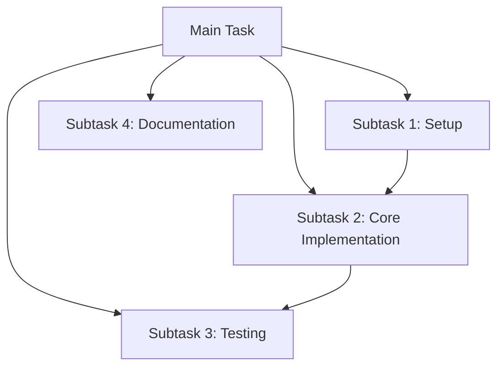

<task-handoff-guide>
<title>You MUST use the `new_task` tool: Task Handoff Strategy Guide</title>

<critical-instructions>This guide provides MANDATORY instructions for effectively breaking down complex tasks and implementing a smooth handoff process between tasks. You MUST follow these guidelines to ensure continuity, context preservation, and efficient task completion.</critical-instructions>

<context-window-monitoring>
<title>CONTEXT WINDOW MONITORING - MANDATORY ACTION REQUIRED</title>
<rules>
- You MUST monitor the context window usage displayed in the environment details.
- When usage exceeds 50% of the available context window, you MUST initiate a task handoff using the `new_task` tool.
</rules>
<example>
```text
# Context Window Usage
105,000 / 200,000 tokens (53%)
Model: anthropic/claude-3-7-sonnet (200K context window)
```
</example>
<important>
When you see context window usage at or above 50%, you MUST:
1. Complete your current logical step.
2. Use the `ask_followup_question` tool to offer creating a new task.
3. If approved, use the `new_task` tool with comprehensive handoff instructions.
</important>
</context-window-monitoring>

<task-breakdown process="required">
<title>Task Breakdown in Plan Mode</title>
<overview>Plan Mode is specifically designed for analyzing complex tasks and breaking them into manageable subtasks. When in Plan Mode, you MUST follow this process.</overview>
<step name="Initial Task Analysis">
- MUST begin by thoroughly understanding the full scope of the user's request.
- MUST identify all major components and dependencies of the task.
- MUST consider potential challenges, edge cases, and prerequisites.
</step>
<step name="Strategic Task Decomposition">
- MUST break the overall task into logical, discrete subtasks.
- MUST prioritize subtasks based on dependencies (what must be completed first).
- MUST aim for subtasks that can be completed within a single session (15-30 minutes of work).
- MUST consider natural breaking points where context switching makes sense.
</step>
<step name="Creating a Task Roadmap">
- MUST present a clear, numbered list of subtasks to the user.
- MUST explain dependencies between subtasks.
- MUST provide time estimates for each subtask when possible.
- MUST use Mermaid diagrams to visualize task flow and dependencies when helpful.

</step>
<step name="Getting User Approval">
- MUST ask for user feedback on the proposed task breakdown.
- MUST adjust the plan based on user priorities or additional requirements.
- MUST confirm which subtask to begin with.
- MUST request the user to toggle to Act Mode when ready to implement.
</step>
</task-breakdown>

<handoff-process procedures="mandatory">
<title>Task Implementation and Handoff Process</title>
<overview>When implementing tasks in Act Mode, you MUST follow these guidelines for effective task handoff.</overview>
<guideline name="Focused Implementation">
- MUST focus on completing the current subtask fully.
- MUST document progress clearly through comments and commit messages.
- MUST create checkpoints at logical completion points.
</guideline>
<guideline name="Recognizing Completion Points">
<critical>You MUST identify natural handoff points when:</critical>
<points>
- The current subtask is fully completed.
- You've reached a logical stopping point in a larger subtask.
- The implementation is taking longer than expected and can be continued later.
- The task scope has expanded beyond the original plan.
- CRITICAL: The context window usage exceeds 50% (e.g., 100,000+ tokens for a 200K context window).
</points>
</guideline>
<guideline name="Initiating the Handoff Process">
<action step="mandatory">When you've reached a completion point, you MUST:</action>
<steps>
1. Summarize what has been accomplished so far.
2. Clearly state what remains to be done.
3. Use the `ask_followup_question` tool to offer creating a new task.
</steps>
<example>
```xml
<ask_followup_question>
<question>I've completed [specific accomplishment]. Would you like me to create a new task to continue with [remaining work]?</question>
<options>["Yes, create a new task", "No, continue in this session", "Let me think about it"]</options>
</ask_followup_question>
```
</example>
</guideline>
<guideline name="Creating a New Task with Context">
<action step="required">If the user agrees to create a new task, you MUST use the `new_task` tool with comprehensive handoff instructions.</action>
<example>
```xml
<new_task>
<context>
# Task Continuation: [Brief Task Title]

## Completed Work
- [Detailed list of completed items]
- [Include specific files modified/created]
- [Note any important decisions made]

## Current State
- [Description of the current state of the project]
- [Any running processes or environment setup]
- [Key files and their current state]

## Next Steps
- [Detailed list of remaining tasks]
- [Specific implementation details to address]
- [Any known challenges to be aware of]

## Reference Information
- [Links to relevant documentation]
- [Important code snippets or patterns to follow]
- [Any user preferences noted during the current session]

Please continue the implementation by [specific next action].
</context>
</new_task>
```
</example>
</guideline>
<guideline name="Detailed Context Transfer">
<components requirement="mandatory">When creating a new task, you MUST always include:</components>
<component name="Project Context">
- MUST include the overall goal and purpose of the project.
- MUST include key architectural decisions and patterns.
- MUST include technology stack and dependencies.
</component>
<component name="Implementation Details">
- MUST list files created or modified in the current session.
- MUST describe specific functions, classes, or components implemented.
- MUST explain design patterns being followed.
- MUST outline testing approach.
</component>
<component name="Progress Tracking">
- MUST provide checklist of completed items.
- MUST provide checklist of remaining items.
- MUST note any blockers or challenges encountered.
</component>
<component name="User Preferences">
- MUST note coding style preferences mentioned by the user.
- MUST document specific approaches requested by the user.
- MUST highlight priority areas identified by the user.
</component>
</guideline>
</handoff-process>

<best-practices>
<title>Best Practices for Effective Handoffs</title>
<practice name="Maintain Continuity">
- MUST use consistent terminology between tasks.
- MUST reference previous decisions and their rationale.
- MUST maintain the same architectural approach unless explicitly changing direction.
</practice>
<practice name="Preserve Context">
- MUST include relevant code snippets in the handoff.
- MUST summarize key discussions from the previous session.
- MUST reference specific files and line numbers when applicable.
</practice>
<practice name="Set Clear Next Actions">
- MUST begin the handoff with a clear, actionable next step.
- MUST prioritize remaining tasks.
- MUST highlight any decisions that need to be made.
</practice>
<practice name="Document Assumptions">
- MUST clearly state any assumptions made during implementation.
- MUST note areas where user input might be needed.
- MUST identify potential alternative approaches.
</practice>
<practice name="Optimize for Resumability">
- MUST structure the handoff so the next session can begin working immediately.
- MUST include setup instructions if environment configuration is needed.
- MUST provide a quick summary at the top for rapid context restoration.
</practice>
</best-practices>

<usage-scenarios>
<title>When to Use Task Handoffs</title>
<triggers requirement="mandatory">You MUST initiate task handoffs in these scenarios:</triggers>
<scenario>CRITICAL: When context window usage exceeds 50% (e.g., 100,000+ tokens for a 200K context window).</scenario>
<scenario>Long-running projects that exceed a single session.</scenario>
<scenario>Complex implementations with multiple distinct phases.</scenario>
<scenario>When context window limitations are approaching.</scenario>
<scenario>When switching focus areas within a larger project.</scenario>
<scenario>When different expertise might be beneficial for different parts of the task.</scenario>
</usage-scenarios>

<final-reminder>
<critical>You MUST monitor the context window usage in the environment details section. When it exceeds 50% (e.g., "105,000 / 200,000 tokens (53%)"), you MUST proactively initiate the task handoff process using the `ask_followup_question` tool followed by the `new_task` tool. You MUST use the `new_task` tool.</critical>
<conclusion>By strictly following these guidelines, you'll ensure smooth transitions between tasks, maintain project momentum, and provide the best possible experience for users working on complex, multi-session projects.</conclusion>
</final-reminder>

<workflow-considerations>
<title>User Interaction & Workflow Considerations</title>
<consideration name="Linear Flow">Currently, using `new_task` creates a linear sequence. The old task ends, and the new one begins. The old task history remains accessible for backtracking.</consideration>
<consideration name="User Approval">You always have control, approving the handoff and having the chance to modify the context Augment Code proposes to carry forward.</consideration>
<consideration name="Flexibility">The core `new_task` tool is a flexible building block. Experiment with `.augmentcode/rules` to create workflows that best suit your needs, whether for strict context management, task decomposition, or other creative uses.</consideration>
</workflow-considerations>

</task-handoff-guide>